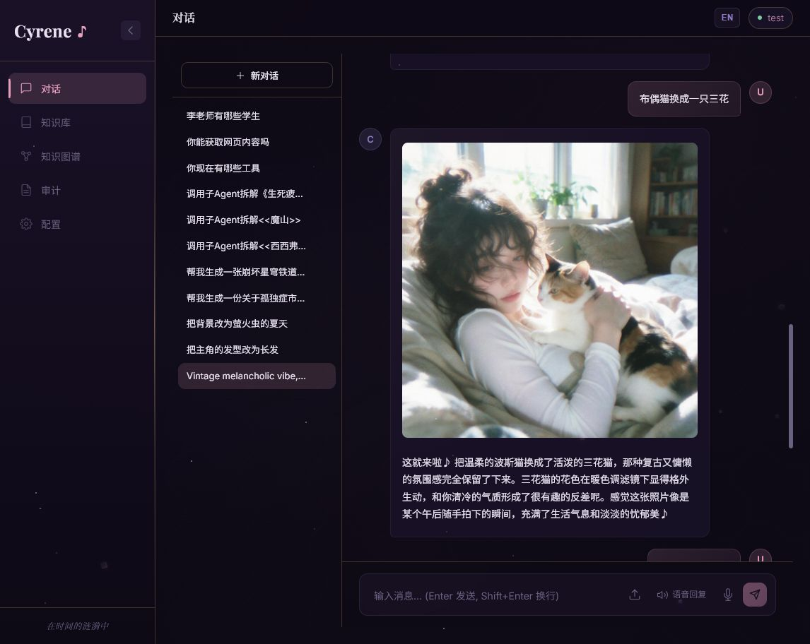
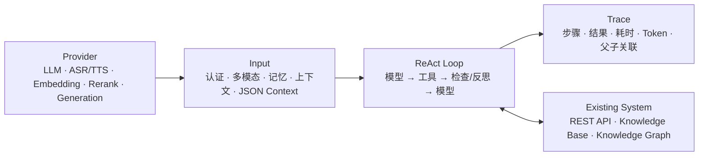
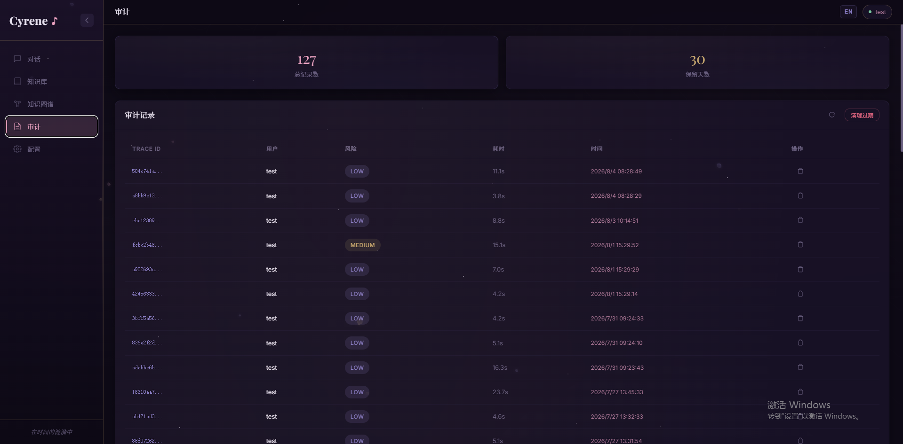
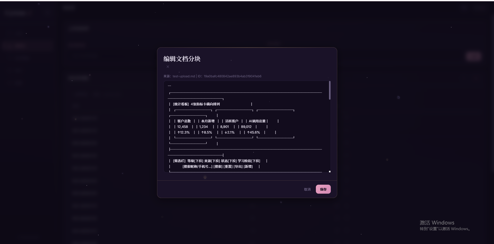
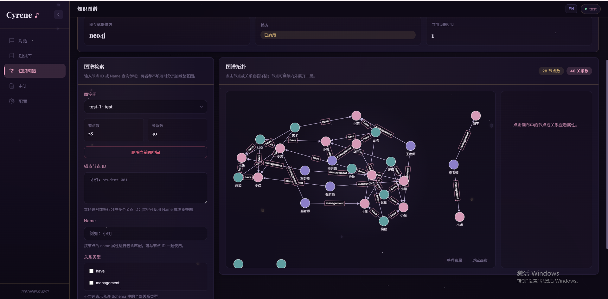

<p align="right"><a href="./README_EN.md">English</a></p>

# Cyrene Agent — 面向已有系统的专用 Agent 开发框架

> 将已有业务系统、领域知识和权限体系接入自主 ReAct Agent，而不是重新开发一套孤立的 AI 应用。

Cyrene Agent 是一个使用 Java 21 构建的 Agent 开发框架。它面向垂直领域开发者，帮助已有系统快速获得自然语言入口、项目接口调用、企业知识检索、关系数据检索、子 Agent 协作和全链路 Trace 能力。

## 为什么需要 Cyrene Agent

当前大部分 Agent 产品面向最终使用者的日常生活与办公：整理文档、编写代码、查询公开信息，主要服务办公者和开发者个人。

Cyrene Agent 解决的是另一类问题：**如何为已有系统构建专用 Agent**。

| 通用 Agent          | Cyrene Agent |
|-------------------|---|
| 面向最终使用者           | 面向垂直领域开发者和系统集成者 |
| 以通用办公与公开信息为主      | 以已有项目接口、私有知识和领域数据为主 |
| 对接的系统工具通常需要逐个手工接入 | 自动发现项目接口并生成工具配置 |
| 依赖模型自身理解权限        | 沿用原系统 Token 和权限边界 |
| 关系数据常被压成文本片段      | 文档走向量检索，关系数据走知识图谱 |

**所有信息数据均不会上云**



## 核心运行模式

整个架构围绕 **Provider → Input → ReAct Loop → Trace** 收束，Tool 作为 ReAct Loop 与业务系统之间的能力边界。



### Provider

Provider 统一模型能力的装配边界，围绕主 LLM 与工具调用模型，支持 Vision、ASR/TTS、Embedding、Rerank、Classifier 和 Realtime 等独立能力。图像、视频等生成能力通过 Provider 配置驱动的生成工具接入。各能力可以选择不同供应商、模型、端点和并发策略，便于企业按质量、成本和数据边界自由组合。

### Input

Input 不只是用户输入，还负责认证、多模态解析、短期与长期记忆注入、上下文构建以及请求级 JSON Context。接入方可以在 Context 中扩展可信参数，例如 `userId`、`tenantId`、输出模式、图谱范围和用户凭证，使 Agent 继承已有系统的身份、租户与业务作用域。

### ReAct Loop

ReAct Loop 执行“模型决策 → 工具调用 → 工具结果检查 → 模型继续决策或输出”的循环。Inspector 与自适应反思机制根据错误、空结果、低相关性和重复调用等信号引导下一步行为。

工具还能通过结构化结果状态推动后续调用进化。例如知识库检索第一次使用低成本的原始查询；当结果处于可挽救的相关度区间时，下一轮隐式升级为查询改写、多查询、Step-back 与 HyDE 组合检索；完全无关或已经升级过的结果不会重复消耗改写成本。

### Trace

Trace 覆盖整个运行过程，包括输入、模型轮次、工具调用与结果、检查和反思状态、运行耗时、Token 消耗、确认决策及最终输出。子 Agent 拥有独立 Trace，并通过 `parent_trace_id` 与主 Agent 关联，从而还原完整任务树。



## 四项关键能力

### 1. 一键对接已有项目接口


首次启动进入管理控制台后，可以指定本地项目目录与业务服务地址。Cyrene Agent 优先解析项目已有的 OpenAPI/Swagger 文档；没有规范文件时，由专用发现 Agent 使用受限环境工具扫描代码：

```text
OpenAPI/Swagger
       └─ 不存在 → code_glob → code_grep → read_class_hierarchy（父类最多 2 层）
                                      ↓
                              project-apis.json
                                      ↓
                              热加载到 ToolRegistry
```

发现流程会汇总接口方法、路径、参数 JSON Schema、返回类型、认证模式和 Token 注入方式。扫描结果先由开发者确认，再写入 `project-apis.json` 并热加载，不需要为每个接口手写 Tool。

Agent 调用业务接口时采用用户 Token 透传。调用方通过可信的 `context.credentials` 提供当前用户凭证，框架按接口配置注入 Header、Query 或其他位置，以原用户身份访问系统。权限判断仍由已有系统完成，不会把 Agent 变成绕过权限的超级账号。


### 2. 核心抽象层收束

项目不以固定工作流节点为核心，而以请求级 ReAct Loop 为核心。Provider、Input、Tool、ReAct 和 Trace 各自维护单一职责；Agent 模块只负责组合运行时、会话策略、子 Agent 和请求作用域。开发者可以替换模型、存储或工具实现，而不需要重写整条执行链。

### 3. 分离文档知识与关系数据

企业文档与关系型业务数据需要不同的检索方式：

- `knowledge_base_search` 面向制度、手册、合同和技术文档。支持 Milvus 或 pgvector，以 collection 作为知识集合边界；切块优先保持段落与语义完整，再执行 Embedding、混合检索和可选 Rerank。


- `knowledge_graph_search` 面向实体、关系和路径。Neo4j 保存图数据，不把关系结果伪装成文档 Chunk，避免无关文本降低模型专注度。


- 图谱租户作用域来自可信 Context 中的 `tenantId`。启用多租户映射时，租户与 Graph Space 的授权关系持久化在 MySQL `graph_space_bindings` 中；请求上下文只能缩小图谱范围，模型不能自行扩大租户、Schema 或主体范围。

Milvus、pgvector、Neo4j、MySQL 和 Redis 均可由本地 Docker Compose 驱动，私有知识与业务数据默认留在本地部署边界内。向量库的租户映射可以由接入系统在 collection/部署层组织；当前请求级强隔离重点落在知识图谱的租户与 Graph Space 授权上。

### 4. 热加载工具注册与请求级工具快照

工具并不是把全部能力永久暴露给每一次模型调用：

1. 应用启动时根据 `HARNESS_*` 环境变量注册已启用的内置工具、MCP、Skill 和项目 API 工具。
2. 项目接口配置更新后原子替换 ToolRegistry 中的项目工具，实现热加载。
3. 每次请求开始时创建不可变 `RunToolCatalog` 快照，再根据请求 Context 排除未授权或不需要的工具。
4. 本次 ReAct Loop 始终使用同一个快照，不受运行期间注册表变化影响。
5. 子 Agent 在继承请求权限的基础上再使用工具白名单，只获得与人设和任务匹配的能力。

这套机制同时降低模型选择干扰、非必要调用成本和越权风险。

## 模块结构

| 模块 | 职责 |
|---|---|
| `harness-core` | 公共模型、环境配置、请求上下文、分页和运行 Trace 契约 |
| `harness-provider` | 模型 Provider 与 LangChain4j 适配 |
| `harness-input` | 认证、多模态输入、Gap 分析、记忆存储与压缩 |
| `harness-tool` | Tool 注册与执行、项目接口、MCP、Skill、RAG 和知识图谱 |
| `harness-react` | ReAct Loop、Inspector 与自适应反思 |
| `harness-trace` | Trace 采集、持久化与清理 |
| `harness-agent` | 运行时组合、上下文准备、子 Agent 与工具装配 |
| `harness-server` | HTTP/SSE API、管理接口与 Web 控制台 |

## 快速开始

### 环境要求

- Java 21+
- Maven 3.8+
- Docker 与 Docker Compose

### 使用 Docker Compose

```bash
cp .env.example .env
# 编辑 .env，至少配置主 Chat Model
docker compose -f docker/docker-compose.yml up -d --build
```

知识图谱是可选能力：

```bash
docker compose -f docker/docker-compose.yml --profile graph up -d neo4j
```

### 本地构建

```bash
mvn clean package -pl harness-server -am -DskipTests
java -jar harness-server/target/harness-server-0.5.8.jar
```

服务默认监听 `8080`。打开 Web 控制台后，可以完成项目接口扫描、知识库上传、图谱管理和 Agent 对话。

完整配置见 [.env.example](./.env.example)。

## 对话 API 示例

```json
{
  "text": "以我的身份查询当前项目中待处理的审批，并结合公司制度说明下一步",
  "context": {
    "outputMode": "streaming",
    "userId": "user-001",
    "tenantId": "tenant-a",
    "credentials": {
      "businessToken": "<current-user-token>"
    }
  }
}
```

`credentials` 中的键不是框架硬编码字段；示例中的 `businessToken` 必须与 `project-apis.json` 对应接口配置的 `credentialKey` 一致。

常用入口：

| 方法 | 路径 | 说明 |
|---|---|---|
| `POST` | `/api/chat` | 阻塞或 SSE 流式 Agent 请求 |
| `DELETE` | `/api/chat/{sessionId}` | 取消运行中的请求 |
| `GET` | `/api/sessions` | 游标分页查询会话 |
| `POST` | `/api/knowledge/upload` | 上传企业知识文档 |
| `POST` | `/api/project-discovery/scan` | 扫描已有项目接口 |
| `POST` | `/api/project-discovery/reload` | 热加载项目接口工具 |
| `GET` | `/api/health` | 健康检查 |

## 联系我
邮箱1：1768576157@qq.com
邮箱2：cken48153@gmail.com

## 许可证

Apache License 2.0
