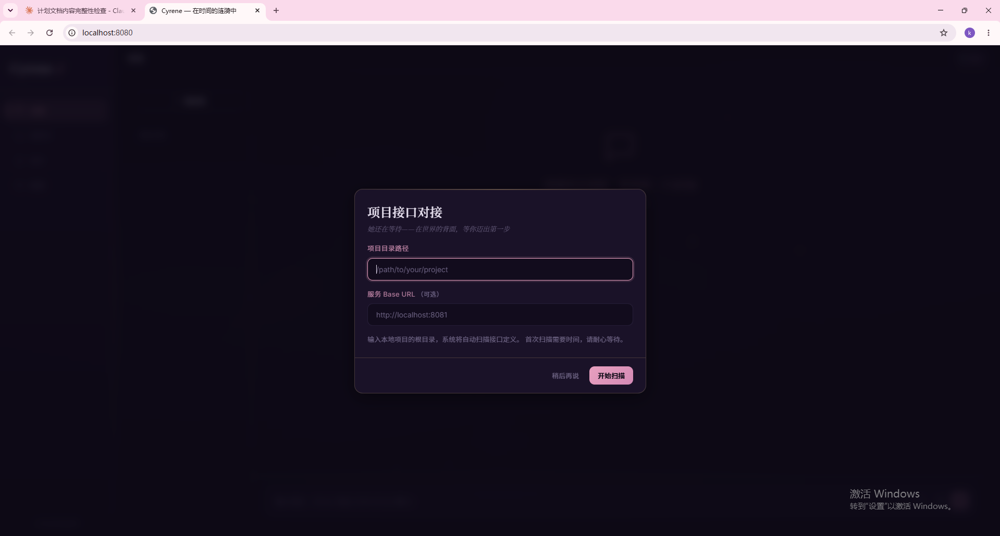
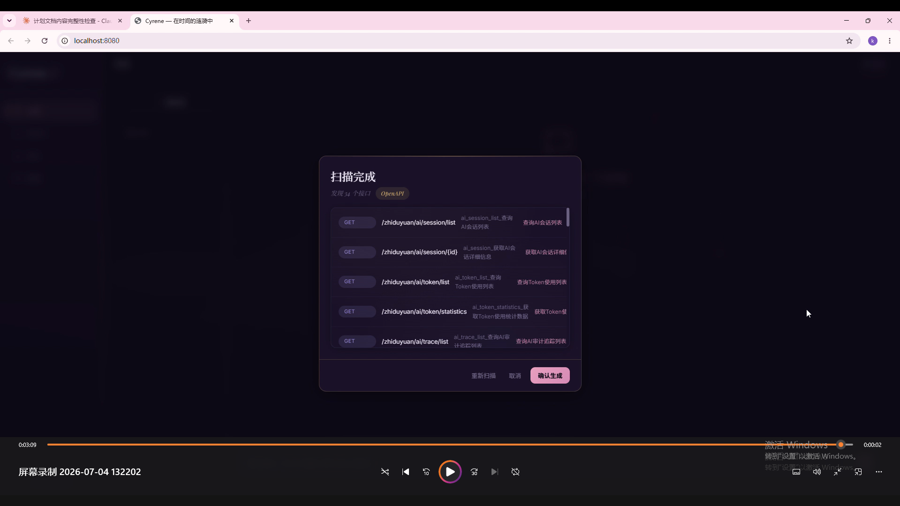
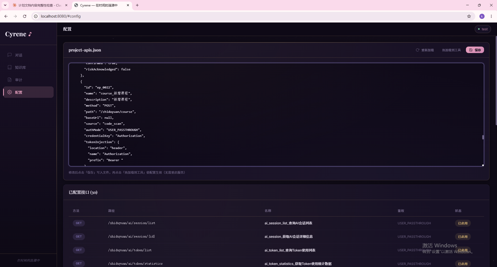
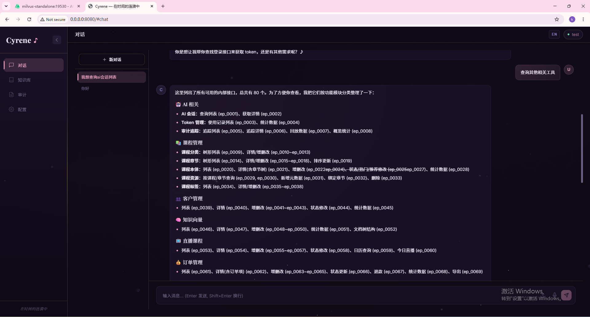

<p align="right"><a href="./README_EN.md">English</a></p>

# Cyrene Agent

基于 **Harness 编排架构** 的 Java AI Agent 应用开发框架。提供可插拔的模型 Provider、内置 RAG 知识库、会话记忆与 5 层流水线编排，可作为脚手架快速搭建并定制面向业务的 Agent 应用。   ---------1768576157@qq.com

## 首次启动

为了对接AI应用，那么我们必然需要针对已有系统进行对接——这正是初始化工作的意义所在。Cyrene Agent 内置了项目接口发现能力，能够自动扫描你的现有项目，在基础的Glob与Grep基础上，我还添加了ClassHierarchy对获取的类进行递归检索父类结构，以获取完整的参数结构。识别 REST API 接口并生成结构化的参数 Schema，让 Agent 具备与宿主系统交互的能力。

**一键发现项目接口：**

> Web UI首次启动时，指定项目目录即可自动扫描所有 Controller 接口，生成 `project-apis.json` 配置文件。支持 Spring Boot、Express、Flask 等主流框架，自动解析 DTO/VO 类继承结构。









## 快速构建对接系统项目的AI应用Agent

为你的产品构建 AI Agent 不必从零开始。Cyrene Agent 提供生产可用的基础能力——初始化工具配置，模型抽象、RAG、记忆、工具、审计——让你专注于业务逻辑而非底层 plumbing。配置模型、注册工具、即可上线。

### 编排架构

Cyrene Agent 采用 **Harness 编排模式**：通用编排框架包裹领域组件，由框架处理横切关注点（模型路由、记忆、审计、工具执行），业务逻辑通过预定义的扩展点接入。这意味着你可以更换模型、添加工具或调整记忆策略，而无需改动流水线核心。

## 核心特性

### 5 层流水线架构

```
Input → Session Lifecycle → Preprocess → ReAct Loop (AI ↔ Tool ↔ Inspection) → Post-process → Audit
```

每个请求经过结构化流水线，各层独立可观测、可配置、可追踪。

### 6 种独立模型类型

每种模型类型可独立配置 Provider、API Key 和端点：

| 类型 | 用途 | 支持的 Provider |
|------|------|-----------------|
| Chat | 对话 + 工具调用 | OpenAI、Anthropic、Ollama、DashScope 等 |
| Vision | 图片/视频理解 | OpenAI、Anthropic |
| Voice | 语音识别 + 语音合成 | OpenAI |
| Embedding | 多模态向量化 | OpenAI、Ollama |
| Rerank | 检索结果重排序 | OpenAI 兼容接口 |
| Realtime | 实时多模态（预留） | — |

可自由混搭——例如 Chat 用 DashScope、Embedding 用 OpenAI、Rerank 用本地 Ollama。

### 内置 RAG 知识库

通过 API 上传文档（PDF、DOCX、XLSX、TXT、Markdown 等），自动完成文本提取、语义分块、Embedding 并存储到 PostgreSQL pgvector。

**完整 RAG 流水线：**

```
用户查询
  │
  ▼
查询改写（可选，环境变量插拔）
  │  none      → 透传原始查询（默认）
  │  hyde      → LLM 生成假设性文档作为检索查询（提升精准度）
  │  multi-query → LLM 生成多个不同措辞的查询，分别检索后合并（提升召回率）
  │  step-back → LLM 生成更通用的抽象查询（适合过于具体的问题）
  │
  ▼
多路召回（可选，环境变量插拔）
  │  语义向量召回  → pgvector cosine similarity（默认）
  │  关键词全文召回 → PostgreSQL tsvector/tsquery（与语义互补）
  │  知识图谱召回  → 预留扩展
  │  多路结果按文档 ID 去重合并（CompletableFuture 并行）
  │
  ▼
语义上下文增强
  │  启发式检测截断块（标点/结构/续接词）
  │  自动回溯 prev_chunk 补全上下文（最多 2 次）
  │
  ▼
Rerank 重排序（可选）
  │  Cross-encoder 精排，或按相似度分数排序
  │
  ▼
注入 System Prompt → LLM 结合知识库上下文 + 对话历史生成回答
```

**查询改写策略对比：**

| 策略 | 原理 | 适用场景 |
|------|------|----------|
| HyDE | LLM 生成"假答案"，用假答案去向量检索 | 短查询/抽象查询，直接 embedding 效果差 |
| Multi-Query | LLM 生成 N 个不同措辞的查询，分别检索合并 | 同一问题有多种表达，单一查询召回不全 |
| Step-Back | LLM 生成更通用的版本，先获取背景知识 | 问题过于具体，直接检索命中率低 |

**大文件处理：** 超过 100KB 的文件采用"语义切片 → 合并到模型上下文 40% → 并行摘要"的策略，将数百次 LLM 调用压缩到个位数（1MB 文件约 5-8 次），上下文窗口大小从模型名称自动检测。

### 会话记忆与智能压缩

- **短期记忆**：按会话 LRU 缓存对话历史，支持分布式 Redis 缓存
- **长期记忆**：从已结束会话中 AI 提取的用户偏好，自动注入 System Prompt
- **小压缩**：ReAct 循环中去除工具调用块（纯代码，零成本）
- **大压缩**：上下文窗口接近上限时 AI 智能提炼旧消息（时间衰减加权：RECENT / MIDDLE / OLD）

**压缩流程：** 先压缩旧消息 → 从 DB 重建缓存 → 再保存当前用户消息。当前用户消息永远不会被压缩。

### 多模态回退

当 Chat 模型不支持视觉/音频能力时，`FallbackChatModel` 透明路由到 Vision 或 Voice Provider，无需修改业务代码。

### ReAct 引擎与 Inspection

工具调用循环，每步启发式检查结果（PASS / TOOL_ERROR / WRONG_TOOL / INSUFFICIENT / NEEDS_RETRY），可配置遇错即停，长工具交互时自动裁剪上下文。

### 子代理（Sub-Agent）

LLM 通过 `spawn_subagent` 工具派生子任务，支持依赖解析与并行执行，每个子代理拥有独立 ReActEngine 实例。

### MCP 远程工具

通过 MCP（Model Context Protocol）HTTP 注册外部工具。支持 JSON 配置文件或环境变量，自动发现 `tools/list` 并缓存。

### 联网搜索

`WebSearchTool` 支持多引擎回退链：Tavily → SerpAPI → DuckDuckGo，无 API Key 的引擎自动跳过，DuckDuckGo 始终可用。

### 项目接口发现

自动扫描现有项目，识别 REST API 接口并生成结构化配置。发现工具（`code_glob`、`code_grep`、`read_class_hierarchy`）在 `HARNESS_PROJECT_DISCOVERY_ENABLED=true` 时注册到主工具集，普通对话中也可使用。`read_class_hierarchy` 支持 Java/C#/C++/Python/JS/TS 等多语言类结构解析，自动检测 `.git` 实现跨模块父类查找。

### 流式输出与取消

- **SSE 流式输出**：`context.outputMode=streaming` 时实时推送 token、ReAct 步骤、完成事件
- **请求取消**：`DELETE /api/chat/{sessionId}` 触发 `CancellationToken`，中断 LLM 调用、工具执行和子代理线程
- **JWT 滑动窗口刷新**：Token 剩余有效期低于阈值时自动刷新，新 Token 通过 `X-New-Token` 响应头返回

### 六层容错机制

| 层级 | 机制 | 策略 |
|------|------|------|
| Tool 调用重试 | 工具执行失败 | 最多重试 3 次，错误结果传递给 LLM 决策 |
| LLM API 重试 | 429/503/超时 | 指数退避（1s→2s→4s），最多 3 次 |
| MCP 断线重连 | IOException | 重建 OkHttpClient 并重试 1 次 |
| 消息写入重试 | DB 写入失败 | 重试 3 次 → 单条同步写 → 死信队列 |
| Refinement 卡住恢复 | 质量评估卡住 | 定时扫描，CAS 重置为 pending |
| 知识库批量回滚 | 批量插入失败 | 显式事务回滚 + 清理孤立文件 |

## 快速开始

### 环境要求

- Java 21+
- Maven 3.8+
- PostgreSQL + pgvector 扩展（RAG，可选）
- MySQL 8+（审计 + 会话记忆，可选）
- Redis（分布式缓存，可选）

### 构建

```bash
# 构建所有模块（生成 cli 和 server 的 fat JAR）
mvn clean package -DskipTests

# 运行测试
mvn test

# 运行集成测试（需要数据库）
mvn test -Pintegration
```

### 配置

```bash
cp .env.example .env
# 编辑 .env，至少配置：
#   HARNESS_MODEL_CHAT_API_KEY
#   HARNESS_MODEL_CHAT_PROVIDER
#   HARNESS_MODEL_CHAT_BASE_URL
#   HARNESS_MODEL_CHAT_MODEL
```

`.env` 由 `EnvConfig` 从工作目录自动加载；系统环境变量优先级更高。

#### 环境变量分类

| 级别 | 变量 | 说明 |
|------|------|------|
| **必填** | `HARNESS_MODEL_CHAT_API_KEY` | 对话模型密钥，所有 Provider 构造函数 requireString，不配直接崩溃 |
| **必填** | `HARNESS_MODEL_CHAT_BASE_URL` | API 地址，非 OpenAI 官方必须配（如 DashScope） |
| **必填** | `HARNESS_MODEL_CHAT_MODEL` | 模型名称，不配默认 gpt-4o |
| 功能必填 | `HARNESS_SERVER_ENABLED` / `HARNESS_CLI_ENABLED` | 至少开一个，否则无入口 |
| 功能必填 | `HARNESS_AUTH_TOKEN` | auth_mode=token 时必填 |
| 功能必填 | `HARNESS_RAG_PG_*` | 需要 RAG 知识库时必填 |
| 功能必填 | `HARNESS_AUDIT_DB_*` | 需要审计持久化时必填 |
| 功能必填 | `HARNESS_MODEL_EMBEDDING_*` | 需要知识库上传/检索时必填 |
| 可选 | 其余所有变量 | 有合理默认值或功能可关闭 |

### 运行

```bash
# 启动 HTTP 服务（默认端口 8080）
java -jar harness-server/target/harness-server-${revision}.jar
```

Windows 用户可直接在项目根目录放置 `.env` 后运行上述 `java -jar` 命令，无需手动 export 环境变量。

### 测试

```bash
curl -X POST http://localhost:8080/api/chat \
  -H "Content-Type: application/json; charset=utf-8" \
  -d '{"text":"你好，你能做什么？"}'
```

## API 端点

| 方法 | 路径 | 说明 |
|------|------|------|
| `POST` | `/api/auth/token` | 获取 JWT Token（auth 模式为 jwt 时） |
| `POST` | `/api/chat` | 发送消息，获取 Agent 回复（SSE 流式） |
| `DELETE` | `/api/chat/{sessionId}` | 取消进行中的对话请求 |
| `POST` | `/api/sessions` | 创建新会话 |
| `GET` | `/api/sessions` | 列出会话（游标分页，可按 userId/status 过滤） |
| `GET` | `/api/sessions/{sessionId}` | 获取会话详情 |
| `GET` | `/api/sessions/{sessionId}/messages` | 获取会话消息历史 |
| `GET` | `/api/sessions/{sessionId}/stats` | 获取会话统计信息 |
| `DELETE` | `/api/sessions/{sessionId}` | 关闭会话（消息保留在 DB） |
| `POST` | `/api/knowledge/upload` | 上传文档到知识库（multipart） |
| `GET` | `/api/knowledge/{collection}` | 列出集合中的文档 |
| `DELETE` | `/api/knowledge/{collection}` | 删除集合中所有文档 |
| `DELETE` | `/api/knowledge/{collection}/{documentId}` | 删除指定文档 |
| `GET` | `/api/trace/{id}` | 按 ID 查询 Trace |
| `GET` | `/api/traces` | 列出最近 Trace |
| `GET` | `/api/traces/stats` | Trace 统计与保留配置 |
| `DELETE` | `/api/traces/cleanup` | 手动清理过期 Trace |
| `DELETE` | `/api/traces/{traceId}` | 删除指定 Trace |
| `POST` | `/api/project-discovery/scan` | 触发项目接口扫描 |
| `GET` | `/api/project-discovery/config` | 获取接口配置 |
| `PUT` | `/api/project-discovery/config` | 更新接口配置 |
| `POST` | `/api/project-discovery/reload` | 热加载接口配置 |
| `GET` | `/api/health` | 健康检查 |

### 对话请求示例

```json
{
  "text": "资产管理系统是什么？",
  "attachments": [],
  "context": {
    "outputMode": "streaming",
    "userId": "user-001",
    "enableThinking": true
  }
}
```

请求头可携带 `X-Session-Id` 复用会话。JWT 模式下，Token 剩余有效期低于阈值时，新 Token 通过 `X-New-Token` 响应头返回。

### 对话响应示例（阻塞模式）

```json
{
  "output": "...",
  "riskLevel": "LOW",
  "traceId": "uuid",
  "steps": 1,
  "sessionId": "abc123"
}
```

### SSE 事件

- **阻塞模式**：`event: done`（完整结果 JSON）、`event: error`（错误 JSON）
- **流式模式**（`context.outputMode=streaming`）：`event: start`、`event: token`、`event: step`、`event: done`、`event: error`

### 知识库上传

```bash
curl -X POST http://localhost:8080/api/knowledge/upload \
  -F "file=@document.pdf" \
  -F "collection=default"
```

## 模块架构

```
harness-env           ← 基础层：所有 HARNESS_* 环境变量 + HikariCP 连接池 + Redis 连接池
harness-core          ← 核心模型：AgentMessage、AgentTrace、ReActStep、ToolSpec 等
    ├── harness-input        ← 认证(JWT) + 多模态解析 + 大文件合并摘要 + 文本提取 + 分块
    ├── harness-preprocess   ← RAG 查询改写 + 多路召回 + 语义上下文 + Rerank + 记忆管理
    ├── harness-tool         ← 工具接口、注册表、执行器、MCP 适配、Skill 加载、代码发现工具
    ├── harness-audit        ← TraceCollector + TraceStore
    └── harness-ai           ← LangChain4j 集成、6 种模型、ReActEngine、重试容错
harness-agent         ← AgentOrchestrator（串联所有层）+ 子代理编排 + 项目接口发现
harness-server        ← HTTP API 入口（Javalin, SSE 流式, Web UI）
```

## 配置说明

所有配置通过 `HARNESS_` 前缀的环境变量管理，完整列表见 [.env.example](.env.example)。

| 配置组 | 变量 | 说明 |
|--------|------|------|
| 模型 | `HARNESS_MODEL_CHAT_*` 等 | 6 种模型各自的 Provider、Key、端点、超时（默认 300s），上下文窗口自动检测 |
| 服务 | `HARNESS_SERVER_*` | 主机、端口、工作线程 |
| 认证 | `HARNESS_AUTH_MODE` | `none` 或 `jwt` |
| RAG 基础 | `HARNESS_RAG_*` | 向量存储后端（pgvector/milvus）、连接、集合、TopK、相似度阈值 |
| RAG 查询改写 | `HARNESS_RAG_QUERY_REWRITE` | `none` / `hyde` / `multi-query` / `step-back` |
| 存储（记忆+Trace） | `HARNESS_AUDIT_STORE` | `mysql` / `sqlite` / `none`（默认） |
| 缓存 | `HARNESS_MEMORY_REDIS_URL` | 设置后启用 Redis 分布式缓存（多实例部署） |
| 压缩 | `HARNESS_CTX_COMPRESS_*` | 小压缩（ReAct 层）+ 大压缩（AI 层）阈值 |
| 工具 | `HARNESS_TOOL_*` | 内置工具开关与 Web 搜索引擎优先级 |
| MCP | `HARNESS_MCP_CONFIG_FILE` | MCP 服务器 JSON 配置文件 |
| 接口发现 | `HARNESS_PROJECT_DISCOVERY_ENABLED` | 开启后自动扫描项目 REST API，发现工具可在普通对话中使用 |

## 数据库 Schema

- MySQL（不含 users）：[`sql/schema-mysql.sql`](sql/schema-mysql.sql)
- MySQL 用户表：[`sql/schema-users-mysql.sql`](sql/schema-users-mysql.sql)
- PostgreSQL pgvector RAG：[`sql/schema-pgvector.sql`](sql/schema-pgvector.sql)
- 表注释：[`sql/add-comments.sql`](sql/add-comments.sql)

## 测试

```bash
# 单元测试（纯逻辑，无需外部依赖）
mvn test

# 集成测试（需要 MySQL + PostgreSQL + Redis）
mvn test -Pintegration

# 覆盖率报告
mvn jacoco:report
```

测试框架：JUnit 5 + Mockito + AssertJ。集成测试使用 `@Tag("integration")` 注解，通过 `-Pintegration` Profile 运行。

## 扩展指南

### 添加新的 LLM Provider

1. 在 `com.harness.ai.model.impl` 实现对应 Provider 接口
2. 在 `ModelProviderFactory` 中注册
3. 在 `EnvKey.java` 中添加环境变量键（遵循 `HARNESS_MODEL_*` 命名规范）

### 添加新工具

1. 实现 `com.harness.tool.Tool`（`spec()` + `execute()`）
2. 在 `AgentOrchestrator.registerBuiltinTools()` 注册，或通过 MCP 自动发现

### 添加新的查询改写策略

1. 实现 `com.harness.preprocess.rag.rewrite.QueryRewriter`（`rewrite()` + `strategyName()`）
2. 在 `QueryRewriterFactory.create()` 中注册新策略名
3. 设置 `HARNESS_RAG_QUERY_REWRITE=your-strategy`

### 添加新的召回路由

1. 实现 `com.harness.preprocess.rag.route.RetrievalRoute`（`retrieve()` + `routeName()` + `isAvailable()`）
2. 在 `RetrievalRouteFactory.createEnabledRoutes()` 中添加路由创建逻辑
3. 设置 `HARNESS_RAG_MULTI_ROUTE=true` 开启多路并行

## 已知限制

- **Realtime 模型**：接口已预留，暂无 Provider 实现
- **知识图谱召回**：`RetrievalRoute` 接口已预留，暂无后端实现
- **接口发现**：支持无 OpenAPI spec 的项目通过 LLM 扫描，但复杂嵌套类型解析仍有改进空间

## 技术栈

- **Java 21** + Maven 多模块
- **LangChain4j 1.15.0** — LLM 集成、工具规格、Chat Model
- **Javalin 6.1.3** — HTTP 服务（SSE 流式）
- **PostgreSQL + pgvector** — RAG 向量存储 + 全文检索
- **MySQL + HikariCP** — 审计 Trace + 会话记忆
- **Redis + Jedis** — 分布式会话缓存
- **Jackson** — JSON 序列化
- **OkHttp** — HTTP 客户端（语音/API/Rerank/联网搜索）
- **Apache POI + PDFBox** — 文档文本提取（PDF、DOCX、XLSX）
- **dotenv-java** — `.env` 文件自动加载
- **SLF4J + Logback** — 日志
- **JJWT** — JWT 认证

## 许可证

Apache License 2.0
