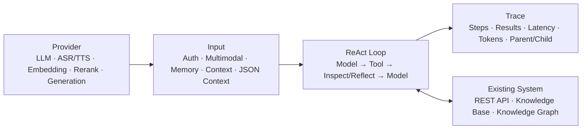

<p align="right"><a href="./README.md">中文</a></p>

# Cyrene Agent — A Dedicated Agent Framework for Existing Systems

> Add an autonomous ReAct Agent to an existing business system, its domain knowledge, and its authorization model instead of building an isolated AI application from scratch.

Cyrene Agent is an enterprise Agent development framework built with Java 21. It is designed for vertical-domain developers who need to give an existing system a natural-language interface, project API control, enterprise knowledge retrieval, relational-data retrieval, sub-agent collaboration, and end-to-end tracing.

## Why Cyrene Agent

Most Agent products target end users in daily life and office work: organizing documents, writing code, and searching public information. They primarily serve office workers and individual developers.

Cyrene Agent addresses a different question: **how do you build a dedicated Agent for an existing system?**

| General-purpose Agent | Cyrene Agent |
|---|---|
| Built for end users | Built for domain developers and system integrators |
| Focused on office tasks and public information | Focused on existing APIs, private knowledge, and domain data |
| Tools are commonly integrated one by one | Project APIs are discovered and converted into tool configuration |
| Authorization is left to model behavior | Existing user tokens and authorization boundaries are preserved |
| Relational data is often flattened into text | Documents use vector retrieval; relationships use a knowledge graph |

**None of the information or data will be uploaded to the cloud**


## Core Runtime Model

The architecture converges on **Provider → Input → ReAct Loop → Trace**, with Tool acting as the capability boundary between the loop and business systems.



### Provider

Provider is the composition boundary for model capabilities. It centers on the main LLM and tool-calling model while supporting independent Vision, ASR/TTS, Embedding, Rerank, Classifier, and Realtime capabilities. Image and video generation are connected through provider-configured generation tools. Each capability can use a different vendor, model, endpoint, and concurrency policy so enterprises can balance quality, cost, and data boundaries.

### Input

Input covers more than user text. It handles authentication, multimodal parsing, short- and long-term memory injection, context construction, and extensible request-level JSON Context. Integrators can provide trusted fields such as `userId`, `tenantId`, output mode, graph scope, and user credentials, allowing the Agent to inherit the identity, tenancy, and business scope of the host system.

### ReAct Loop

The ReAct Loop performs “model decision → tool call → tool-result inspection → next model decision or output.” Inspector and adaptive reflection use tool errors, empty results, low relevance, and repeated calls to guide the next action.

Tools can also expose structured result states that evolve later calls. For example, knowledge-base retrieval starts with a low-cost original query. If the result falls into a recoverable relevance range, the next round implicitly upgrades to query rewriting, multi-query, Step-back, and HyDE retrieval. Completely unrelated results, or a request that has already escalated, do not repeatedly pay the rewriting cost.

### Trace

Trace observes the complete run: input, model rounds, tool calls and results, inspection and reflection status, latency, token consumption, confirmation decisions, and final output. A sub-agent owns an independent trace linked to its parent through `parent_trace_id`, making the full task tree reconstructable.


## Four Defining Capabilities

### 1. One-Click Integration with Existing Project APIs


On first launch, the management console guides the developer to select a local project directory and business service URL. Cyrene Agent first looks for an OpenAPI/Swagger specification. If none exists, a dedicated discovery Agent scans the source through restricted environment tools:

```text
OpenAPI/Swagger
       └─ absent → code_glob → code_grep → read_class_hierarchy (up to 2 parent levels)
                                      ↓
                              project-apis.json
                                      ↓
                              hot-loaded into ToolRegistry
```

Discovery consolidates HTTP methods, paths, parameter JSON Schemas, return types, authentication modes, and token-injection rules. Developers review the result before it is written to `project-apis.json` and hot-loaded, avoiding one manually implemented Tool per endpoint.

Business API calls use user-token passthrough. The trusted caller supplies the current credentials through `context.credentials`, and the framework injects them into headers, query parameters, or another configured location. The existing system still performs authorization under the original user identity; the Agent does not become a permission-bypassing superuser.


### 2. Converged Core Abstractions

The project is centered on a request-scoped ReAct Loop rather than a fixed node workflow. Provider, Input, Tool, ReAct, and Trace each own one responsibility. The Agent module composes the runtime, session policy, sub-agents, and request scope. Developers can replace a model, store, or tool implementation without rebuilding the execution chain.

### 3. Separate Retrieval for Documents and Relational Data

Enterprise documents and relational business data require different retrieval strategies:

- `knowledge_base_search` targets policies, manuals, contracts, and technical documents. It supports Milvus or pgvector and uses collections as knowledge-set boundaries. Chunking prioritizes paragraph and semantic integrity before embedding, hybrid retrieval, and optional reranking.


- `knowledge_graph_search` targets entities, relationships, and paths. Neo4j stores graph data, and graph results are not disguised as document chunks that distract the model.


- The graph tenant scope comes from the trusted `tenantId` in Context. In multi-tenant mode, tenant-to-Graph-Space authorization is persisted in the MySQL `graph_space_bindings` table. Request context can narrow the graph scope; the model cannot expand the tenant, schema, or subject scope.

Milvus, pgvector, Neo4j, MySQL, and Redis can all run through local Docker Compose so private knowledge and business data remain within the local deployment boundary by default. Vector tenancy can be organized by the integrating system at the collection or deployment layer; request-level hard isolation currently focuses on knowledge-graph tenant and Graph Space authorization.

### 4. Hot-Reloadable Tools and Request-Scoped Tool Snapshots

The runtime does not expose every capability to every model call:

1. At startup, enabled built-in tools, MCP tools, Skills, and project API tools are registered according to `HARNESS_*` environment variables.
2. Updating project API configuration atomically replaces the corresponding tools in ToolRegistry.
3. Each request creates an immutable `RunToolCatalog` snapshot and filters unauthorized or unnecessary tools using request Context.
4. A ReAct Loop keeps the same snapshot throughout the run and is unaffected by later registry changes.
5. A sub-agent inherits request permissions and then applies a narrower allowlist matching its persona and task.

This reduces model distraction, unnecessary tool cost, and privilege exposure at the same time.

## Module Layout

| Module | Responsibility |
|---|---|
| `harness-core` | Shared models, environment configuration, request context, pagination, and RunTrace contracts |
| `harness-provider` | Model providers and LangChain4j adapters |
| `harness-input` | Authentication, multimodal input, gap analysis, memory stores, and compression |
| `harness-tool` | Tool registration/execution, project APIs, MCP, Skills, RAG, and knowledge graph |
| `harness-react` | ReAct Loop, Inspector, and adaptive reflection |
| `harness-trace` | Trace collection, persistence, and cleanup |
| `harness-agent` | Runtime composition, context preparation, sub-agents, and tool assembly |
| `harness-server` | HTTP/SSE APIs, management endpoints, and Web console |

## Quick Start

### Requirements

- Java 21+
- Maven 3.8+
- Docker and Docker Compose

### Docker Compose

```bash
cp .env.example .env
# Edit .env and configure at least the main Chat Model
docker compose -f docker/docker-compose.yml up -d --build
```

The knowledge graph is optional:

```bash
docker compose -f docker/docker-compose.yml --profile graph up -d neo4j
```

### Local Build

```bash
mvn clean package -pl harness-server -am -DskipTests
java -jar harness-server/target/harness-server-0.5.8.jar
```

The service listens on `8080` by default. Open the Web console to discover project APIs, upload knowledge, manage graph data, and talk to the Agent.

See [.env.example](./.env.example) for the complete configuration surface.

## Chat API Example

```json
{
  "text": "Query my pending approvals and explain the next step using our company policy",
  "context": {
    "outputMode": "streaming",
    "userId": "user-001",
    "tenantId": "tenant-a",
    "credentials": {
      "businessToken": "<current-user-token>"
    }
  }
}
```

Credential keys are not hard-coded by the framework. In this example, `businessToken` must match the endpoint's `credentialKey` in `project-apis.json`.

Common endpoints:

| Method | Path | Description |
|---|---|---|
| `POST` | `/api/chat` | Blocking or SSE-streaming Agent request |
| `DELETE` | `/api/chat/{sessionId}` | Cancel an active request |
| `GET` | `/api/sessions` | Cursor-paginated session query |
| `POST` | `/api/knowledge/upload` | Upload enterprise knowledge documents |
| `POST` | `/api/project-discovery/scan` | Discover APIs in an existing project |
| `POST` | `/api/project-discovery/reload` | Hot-reload project API tools |
| `GET` | `/api/health` | Health check |

## Contact

Email 1: 1768576157@qq.com<br>
Email 2: cken48153@gmail.com

## License

Apache License 2.0
